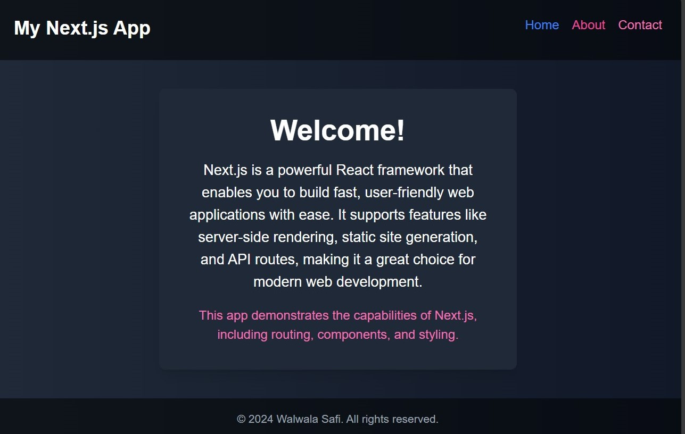

# Simple-Next.js-Project
Dimo


Welcome to the Simple Next.js Project! This is a basic web application built using Next.js, showcasing the framework's capabilities with a straightforward structure.

you can check the live dimo of project [here](https://frabjous-chebakia-a62d92.netlify.app/)


## Features

- **Three Pages**: The project includes three distinct pages:

  - **Home Page**: The landing page featuring an introduction and main content.

  - **About Page**: A page that provides information about the project and its purpose.

  - **Contact Page**: A simple contact form for user inquiries.

- **Server-Side Rendering**: Leverages Next.js's built-in server-side rendering for optimal performance and SEO.

- **Responsive Design**: The layout is mobile-friendly, ensuring a smooth experience on various devices.


## Technologies 
1️⃣  React: Frontend library for building the user interface.

2️⃣  Axios: For making HTTP requests to fetch quotes and images.

3️⃣   global.CSS: For styling the components.

4️⃣  API Ninjas Quotes API: For retrieving quotes.

5️⃣  Pexels API: For fetching background images based on the selected category.


## Customization
◻  You can customize the following aspects of the app:

◻  Quote API: Change the API endpoint in script.js to use a different page provider.

◻  Styling: Modify the CSS in styles.css to change the appearance of the app.

◻  Add More Features: Consider adding features like a favorites list or user-submitted page of next.js project.


### Step-by-Step Installation

1. **Clone the Repository**
   - Open your terminal (Command Prompt, PowerShell, or any terminal emulator).

   - Run the following command to clone the repository to your local machine:

   ```bash
   git clone https://github.com/yourusername/random-quote-machine.gitgit

1. **Navigate to the Project Directory**

   - Change your current working directory to the cloned repository:
   
    ```bash
    cd random-quote-machine

3. **Open the Project in Your Browser**

- Locate the index.html, react files such us app.js, index.js, src that includes the components file in the cloned directory.
- You can either double-click on it or use your terminal to open it with a specific browser. For example, to open it with Google Chrome, you can use:
  
   ```bash
   start chrome index.html

4. **Start the server with**

   ```bash
   npm start

## Author ✅
◻ Github:[ WALWALASAFI ](https://github.com/WALWALASAFI/product-landing-page.git)

◻ Linkedin:  [ Walwala Safi ](https://www.linkedin.com/in/walwala-safi-65b56530a/)

◻ Email: [ walwalasafi](walwalasafi99@gmail.com)

